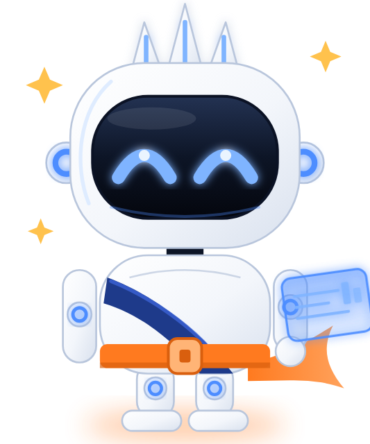
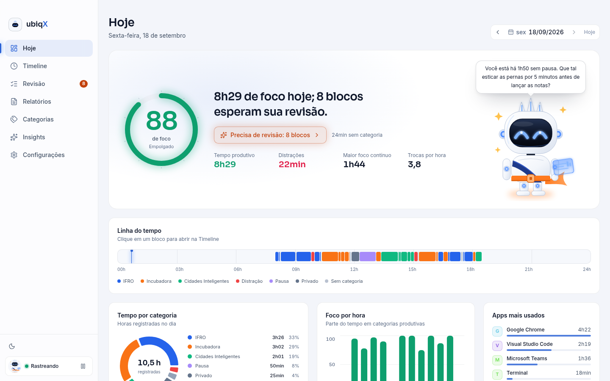
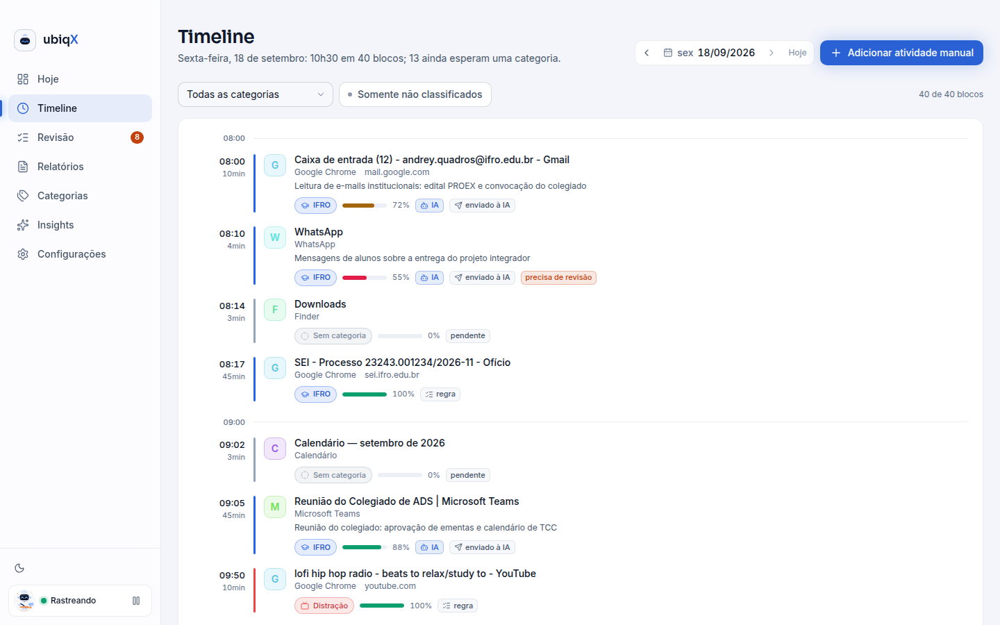
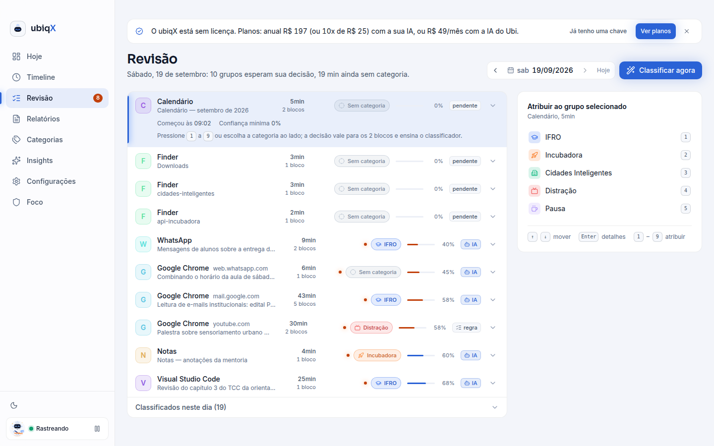
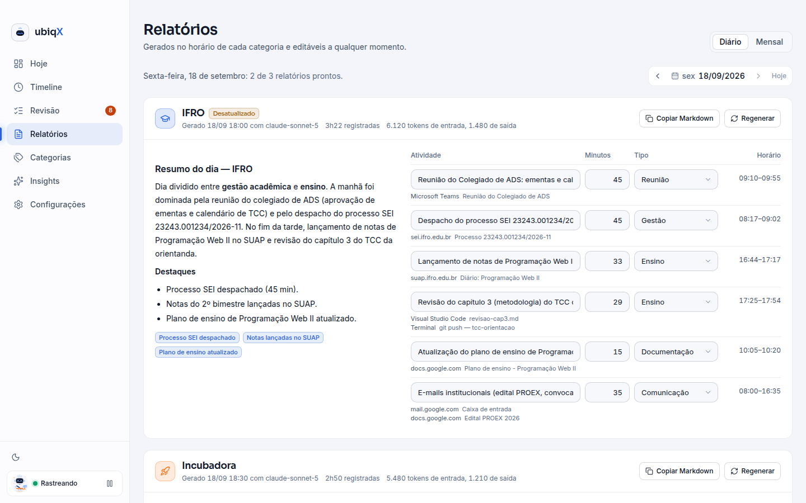
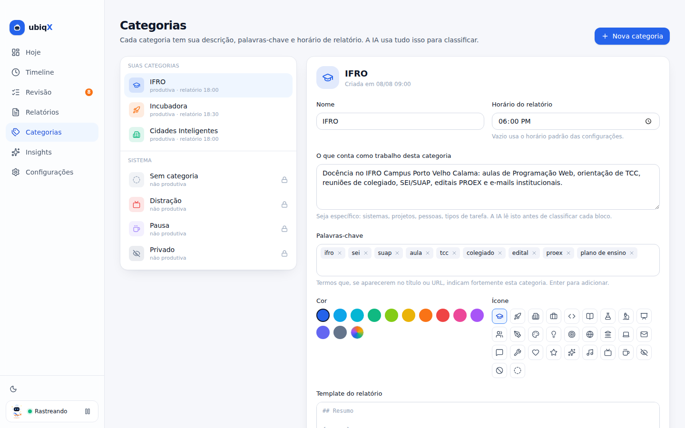
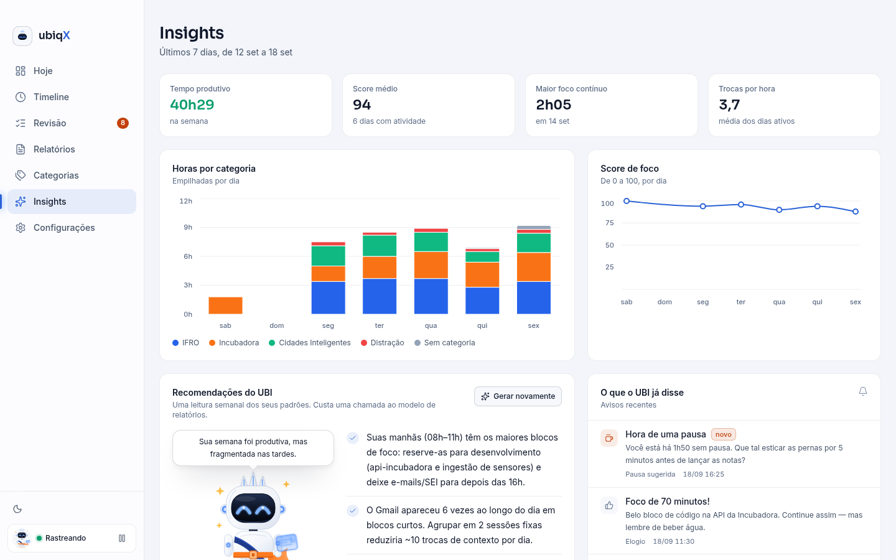
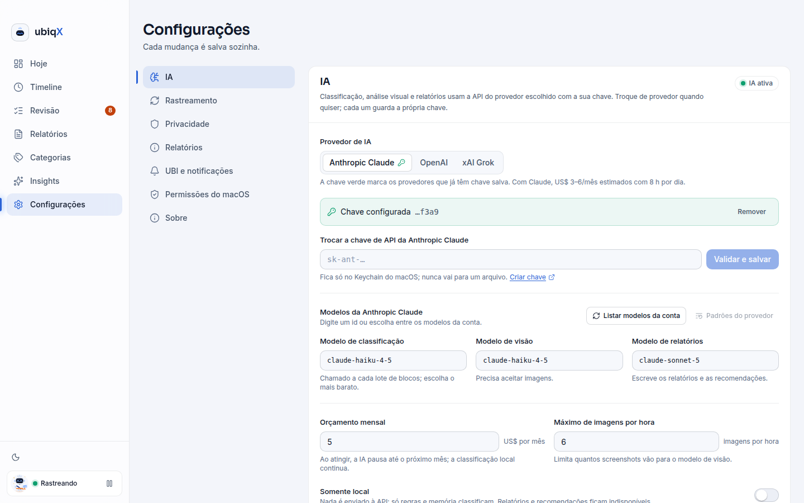
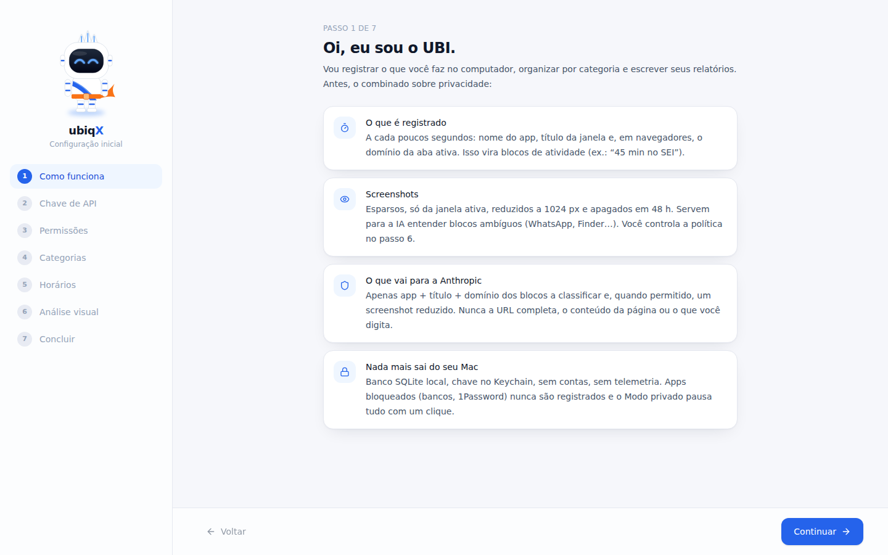

<p align="center">
  
</p>

<h1 align="center">ubiqX</h1>
<p align="center"><strong>Rastreamento inteligente de atividade para macOS, Windows e Linux, com IA nativa e um mascote que cuida do seu foco.</strong></p>
<p align="center">
  <a href="https://github.com/andreyquadros/ubiquitous-engine/actions/workflows/ci.yml"></a>
  
  
  
  
  
</p>

O ubiqX roda em segundo plano na barra de menus (ou na bandeja do sistema), observa **em qual app, janela e site você está**, tira
prints esparsos **só da janela ativa**, e enquadra cada bloco de tempo nas **categorias que você cria**
(IFRO, Incubadora, Cidades Inteligentes…). No horário que você escolher, gera um **relatório diário por
categoria** pronto para virar o relatório mensal de cada instituição. Se ele errar, você corrige em um clique —
e ele aprende. O **UBI**, o mascote, mostra seu humor de foco e avisa quando você está se distraindo.

É um concorrente do [Rize](https://rize.io) com IA embarcada de fábrica, local-first e de código aberto.

## Como funciona

```
 a cada 5 s          blocos de contexto           classificação em cadeia               relatórios
 app · janela · URL ─▶ Segmenter ─▶ SQLite ─▶ regras ▸ memória ▸ IA (texto) ▸ IA (visão) ─▶ diário/mensal
 print da janela ativa (quando permitido)        ▲ correções do usuário ═ aprendizado ═▶ regras sugeridas
```

- **Captura leve**: amostra o app/janela/URL ativo (sem teclas, sem conteúdo). Prints só depois de 20 s no mesmo
  contexto, só da janela em foco, nunca se um app bloqueado estiver visível.
- **Classificação em cadeia, custo mínimo**: regras e memória de correções resolvem a maioria dos blocos de graça;
  o restante vai ao modelo de texto em lote; prints só para blocos ambíguos e sob sua política.
  Custo típico estimado: **US$ 3–6/mês** com Claude, menos com OpenAI ou Grok; orçamento mensal configurável
  que pausa a IA ao ser atingido.
- **Você escolhe a IA**: Anthropic Claude, OpenAI ou xAI Grok, cada uma com a sua própria chave de API guardada no
  cofre do sistema (Keychain no macOS, Gerenciador de Credenciais no Windows, Secret Service no Linux). Troque
  quando quiser em Configurações → IA; as chaves das outras ficam guardadas.
- **Ou a IA do Ubi**: no plano mensal você não precisa de chave nenhuma. Uma licença assinada libera os modelos
  `ubi-fast` e `ubi-smart` através do proxy do ubiqX, que mede o gasto do mês e mostra quanto resta em
  Configurações. Como funciona e como operar o serviço: [`docs/LICENSING.md`](docs/LICENSING.md).
- **Privacidade por padrão**: URLs sem query string, e-mails/telefones/CPF/CNPJ mascarados, títulos de apps de
  mensagens reduzidos ao nome do app; "Dados enviados à IA" mostra exatamente o que saiu da máquina. Modo privado
  com prazo, apps e domínios bloqueados e janelas anônimas viram blocos "[privado]" — o tempo conta, o conteúdo não.
- **Aprende com você**: a fila de Revisão só pergunta o que a cadeia não conseguiu resolver — o que o Ubi classificou
  com confiança fica na lista de baixo, e um clique confirma tudo de uma vez (o que vira memória e resolve o mesmo
  contexto de graça amanhã). Cada correção reclassifica o bloco, alimenta a memória, penaliza a regra que errou e sugere
  "Sempre: sei.ifro.edu.br → IFRO".
- **Relatórios que viram entregas**: itens no passado com tipo (reunião, desenvolvimento, ensino…), minutos e
  evidências; visão mensal por categoria que agrupa continuações ("continuou X — 3 dias, 7 h 20") e exporta Markdown.
- **UBI**: humor derivado do score de foco; avisos com teto diário, cooldown, horário silencioso e silêncio em reuniões.

## Telas

| Hoje | Timeline |
|---|---|
|  |  |

| Revisão (é aqui que ele aprende) | Relatórios |
|---|---|
|  |  |

| Categorias & regras | Insights |
|---|---|
|  |  |

| Configurações | Onboarding |
|---|---|
|  |  |

## Sistemas suportados

| | macOS 13+ (Apple Silicon) | Windows 10/11 (x64) | Linux x64 (X11) |
|---|---|---|---|
| Instalador | `.dmg` (+ `.app.zip`) | `-setup.exe` (NSIS) e `.msi` | `.AppImage` e `.deb` |
| App, janela e título em foco | sim | sim | sim em sessão X11; em sessão Wayland só os apps que rodam pelo XWayland ([guia](docs/WINDOWS-LINUX.md#4-limitações-conhecidas)) |
| URL da aba ativa | Safari, Chrome, Arc, Brave, Edge, Vivaldi, Opera (Automação) | Chrome, Edge, Brave, Opera, Vivaldi, Firefox (UI Automation) | só pelo título da janela |
| Screenshots da janela ativa | sim | sim | sim (X11) |
| Permissões a conceder | Gravação de tela, Automação | nenhuma | nenhuma |
| Chave de API | Keychain | Gerenciador de Credenciais (ou arquivo do usuário) | chaveiro Secret Service (ou arquivo `0600`) |
| Foco: fechar app / aba, esconder janelas | sim | sim (minimiza) | sim (minimiza) |
| Ao começar/encerrar a sessão de foco | atalho do app Atalhos | linha de comando | linha de comando |
| Atualização automática (feed `continuous`) | sim | sim | sim |

Windows e Linux: instalação, limitações e diferenças em [`docs/WINDOWS-LINUX.md`](docs/WINDOWS-LINUX.md).

## Site

A landing page que apresenta o ubiqX AI como produto (planos, downloads, telas) vive em [`site/`](site/) e é publicada no GitHub Pages
em `https://<owner>.github.io/ubiquitous-engine/` pelo workflow `site.yml`; desenvolvimento e deploy em [`site/README.md`](site/README.md).

## Stack

| Camada | Tecnologia |
|---|---|
| Núcleo / daemon | **Rust** — workspace hexagonal (`core` → `storage` / `platform` / `ai` → `engine` → `app` → `desktop` / `cli`) |
| Desktop | **Tauri 2** (tray na barra de menus ou na bandeja, notificações, iniciar com o sistema) |
| UI | **React 19 + TypeScript + Vite + Tailwind 4**, Recharts, Framer Motion, react-three-fiber (UBI em 3D) |
| Dados | **SQLite** local (`rusqlite`, WAL) |
| IA | **Anthropic Messages API**, **OpenAI Chat Completions** ou **xAI Grok** (API compatível com OpenAI) via HTTP, escolhida pelo usuário; saída estruturada JSON em todas |
| Plataforma | macOS (Accessibility, AppleScript, ScreenCaptureKit), Windows (crate `windows`: Win32, UI Automation), Linux (`x11rb`, `/proc`) |
| Segredos | Keychain do macOS, Gerenciador de Credenciais do Windows ou Secret Service (`keyring`), com arquivo do usuário como reserva |

Detalhes em [`docs/ARCHITECTURE.md`](docs/ARCHITECTURE.md).

## Rodando no seu Mac

Guia completo (assinatura estável, permissões, onde ficam os dados, problemas comuns):
[`docs/MACOS-TESTING.md`](docs/MACOS-TESTING.md). Resumo:

```bash
git clone https://github.com/andreyquadros/ubiquitous-engine ubiqx && cd ubiqx
scripts/install-ubi-model.sh                       # opcional: instala a arte do UBI (ubi.png e/ou Ubi.glb de ~/Downloads)
cd apps/desktop && pnpm install && pnpm tauri build
cd ../.. && scripts/codesign-dev.sh                # identidade "ubiqX Dev" — permissões sobrevivem a rebuilds
open target/release/bundle/macos/ubiqX.app
```

Sem toolchain local: baixe o `.app` pronto do GitHub Actions (artifact `ubiqX-macos-app`) ou compile no
[Codemagic](https://codemagic.io) com o `codemagic.yaml` da raiz; quarentena e assinatura em
[`docs/MACOS-TESTING.md`](docs/MACOS-TESTING.md) § 3.1.

**Atualizações.** Cada push vira a release rolante [`continuous`](https://github.com/andreyquadros/ubiquitous-engine/releases/tag/continuous)
(`.dmg` + `.app.zip`, `-setup.exe` + `.msi`, `.AppImage` + `.deb`, os artefatos de atualização assinados e dois
feeds: `latest.json` com as três plataformas e `updater.json` no formato do `tauri-plugin-updater`), publicada de
uma vez pelo GitHub Actions e, com um token, também pelo Codemagic (só macOS; as plataformas dos feeds são
mescladas). O app instalado consulta o `latest.json` ao abrir e a cada 6 h e avisa com banner, notificação e item
no menu da bandeja quando há um build mais novo; **Atualizar agora** baixa com barra de progresso, instala e
reabre o app sozinho, e **Baixar** continua abrindo o instalador do sistema em uso como reserva. A versão de cada
build é `0.1.<número do build>` (`scripts/app-version.mjs`), que é o que o updater compara. No macOS a CI assina
ad hoc, então a atualização automática custa reconceder Gravação de Tela e Automação — o app avisa antes.
Assinatura, secrets, instalação, token do Codemagic e `UBIQX_UPDATE_FEED_URL` em
[`docs/MACOS-TESTING.md`](docs/MACOS-TESTING.md) § 3.2.

Na primeira execução o onboarding pede para **escolher a IA** e colar a chave correspondente, a permissão de
**Gravação de Tela** (reinicie o app depois de conceder) e a **Automação** para o navegador; depois você cria as
categorias e escolhe o horário dos relatórios.

| Provedor | Modelos padrão (classificação / visão / relatórios) | Estimativa com 8 h/dia | Onde criar a chave |
|---|---|---|---|
| Anthropic Claude | `claude-haiku-4-5` / `claude-haiku-4-5` / `claude-sonnet-5` | US$ 3–6/mês | [console.anthropic.com](https://console.anthropic.com/settings/keys) |
| OpenAI | `gpt-5-mini` / `gpt-5-mini` / `gpt-5` | US$ 1–3/mês | [platform.openai.com](https://platform.openai.com/api-keys) |
| xAI Grok | `grok-4-1-fast-non-reasoning` / idem / `grok-4-1-fast-reasoning` | US$ 0,50–2/mês | [console.x.ai](https://console.x.ai) |

Os ids de modelo são editáveis e "Listar modelos da conta" mostra o que a sua chave pode usar. Crie a chave num
projeto/workspace com limite de gasto: é a rede de segurança real. "Entrar com ChatGPT" (OAuth) hoje só identifica o
usuário em apps parceiros da OpenAI e não dá acesso aos modelos; por isso a OpenAI entra por chave de API.

Sem chave, tudo continua funcionando em modo local (regras + memória + relatórios por template).

## Desenvolvimento

```bash
# testes e lint dos crates portáveis (Linux/macOS)
cargo test --workspace --exclude ubiqx-desktop
cargo clippy --workspace --all-targets -- -D warnings

# simulação ponta a ponta de um dia de trabalho com IA falsa (não precisa de Mac nem de chave)
cargo run -p ubiqx-cli -- --ephemeral --fake-ai simulate --seconds 60 --events

# interface no navegador com dados simulados (sem Tauri)
cd apps/desktop && pnpm install && pnpm dev        # http://localhost:1420  (?onboarding=1 mostra o onboarding)

# app desktop em modo dev (macOS, Windows ou Linux)
cd apps/desktop && pnpm tauri dev

# instaladores de Windows e Linux (ver docs/WINDOWS-LINUX.md § 2)
cd apps/desktop && pnpm tauri build --bundles msi,nsis        # Windows
cd apps/desktop && pnpm tauri build --bundles appimage,deb    # Linux
```

Variáveis úteis: `UBIQX_LOG=debug` (log), `UBIQX_FAKE_AI=1` (IA falsa no app desktop), `UBIQX_SCRIPTED=1`
(plataforma roteirizada — o app "trabalha sozinho" para demonstração, sempre com IA falsa a menos que
`UBIQX_ALLOW_REAL_AI=1`), `UBIQX_ANTHROPIC_API_KEY` / `UBIQX_OPENAI_API_KEY` / `UBIQX_XAI_API_KEY` (CLI, junto com
`--provider anthropic|openai|xai`).

CLI: `ubiqx status [data]`, `ubiqx classify`, `ubiqx report <data> --category <id>`, `ubiqx monthly --category <id> --year 2026 --month 9`, `ubiqx export`.

## Estado do projeto

MVP v0.1 — pronto para o primeiro teste local no macOS, no Windows e no Linux (X11). Ver
[`docs/ARCHITECTURE.md`](docs/ARCHITECTURE.md) §8 para as decisões e os próximos passos (ScreenCaptureKit, eventos de
sono/bloqueio de tela, exportação DOCX, Wayland pelos portais, URL do navegador no Linux por acessibilidade).

## Licença

MIT
